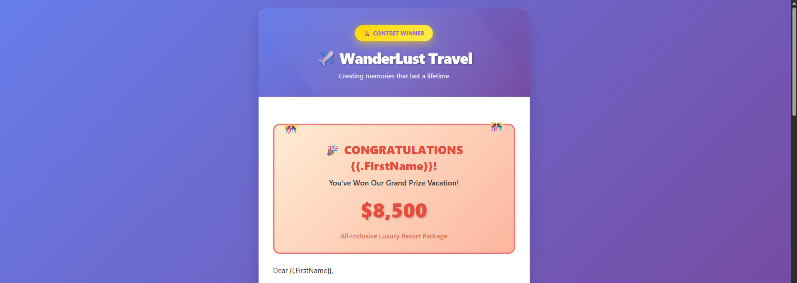
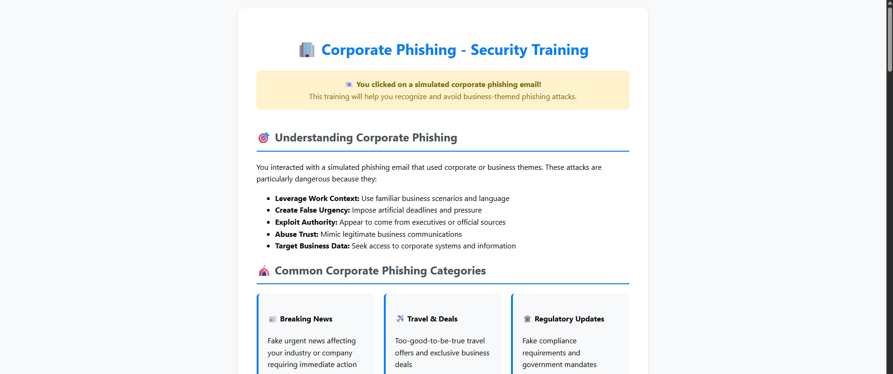
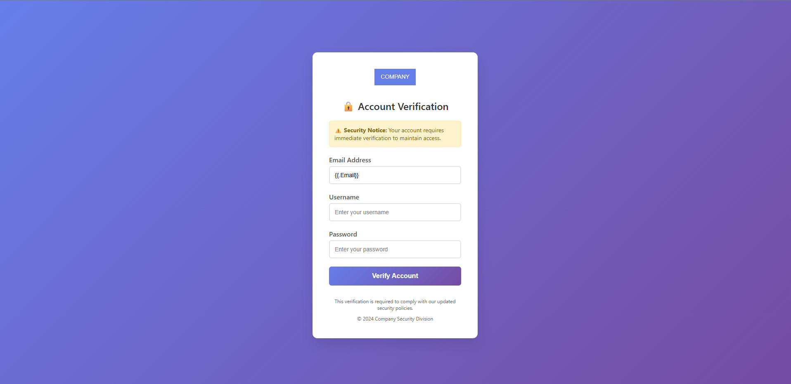
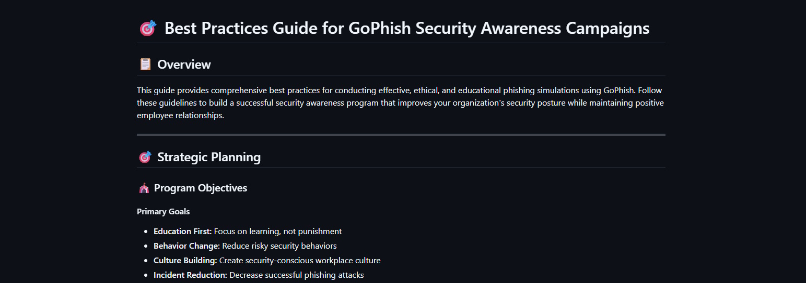
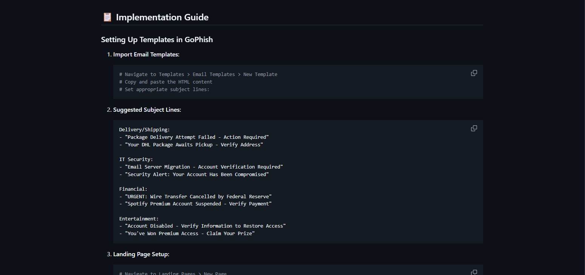
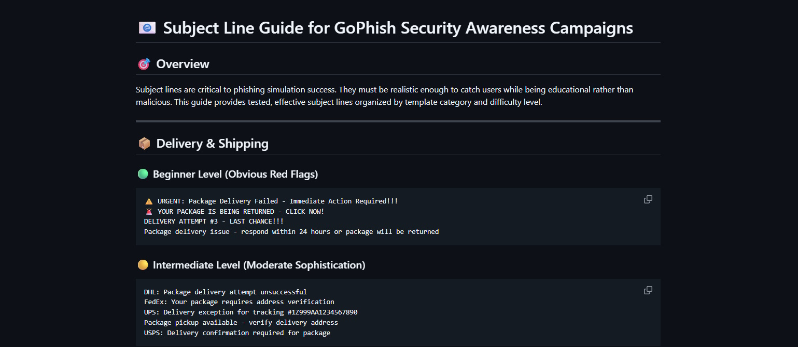

# GoPhish Training Templates - Security Awareness Campaign Collection

[](https://github.com/your-repo/gophish-templates)
[](https://getgophish.com/)
[](LICENSE)

A comprehensive collection of professionally designed email templates and landing pages for conducting effective employee security awareness phishing simulation campaigns using the GoPhish framework.

## 🎯 **What's Included**


<div align="center">
  
</div>

### 📧 **Email Templates (20+ Templates)**
- **Realistic phishing scenarios** mimicking common attack vectors
- **Corporate communication themes** (IT updates, HR notifications, security alerts)
- **Social engineering templates** (delivery notifications, account suspensions, payment alerts)
- **Entertainment platform impersonations** (Spotify, Netflix, gaming platforms)
- **Financial service attacks** (banking, wire transfers, payment confirmations)
- **Cloud service phishing** (Dropbox, Google Drive, Office 365)
- **Multi-category coverage** for comprehensive training programs


<div align="center">
  
</div>

### 🎓 **Educational Modules**
- **Immediate learning opportunities** after simulation clicks
- **Category-specific training** tailored to attack types
- **Interactive quizzes** to reinforce learning
- **Real-world statistics** and impact data
- **Actionable protection strategies** employees can implement
- **Progressive difficulty levels** for ongoing education


<div align="center">
  
</div>

### 🎯 **Landing Pages**
- **Credential harvesting pages** for testing user behavior
- **Educational notification pages** for immediate training
- **Mobile-optimized responsive designs** for all devices
- **Professional, realistic appearance** to maximize effectiveness
- **Instant educational value** rather than just "gotcha" moments

## 🚀 **Features**

### ✅ **Ready-to-Deploy**
- Drop-in templates requiring minimal configuration
- Modern GoPhish syntax with proper template variables
- Mobile-responsive design for all screen sizes


<div align="center">
  
</div>

### 🎨 **Industry Best Practices**
- Based on real-world attack patterns and methodologies
- Updated for 2024 threat landscape
- Professional design matching legitimate services

### ⚖️ **Compliance & Ethics Focused**
- Designed with privacy and legal considerations
- Educational focus over punitive measures
- Immediate learning opportunities for participants

### 🔧 **Highly Customizable**
- Easy branding modifications for your organization
- Configurable difficulty levels and scenarios
- Modular design for mixing and matching components

## 📁 **Repository Structure**

```
gophish-training-templates/
├── 📦 delivery-shipping/
│   ├── dhl_package.html
│   ├── package_pickup.html
│   └── education/
│       └── delivery_phishing_education.html
├── 🔧 it-security/
│   ├── email_issues.html
│   ├── mailbox_compromised.html
│   ├── email_size_limit.html
│   ├── system_update.html
│   ├── webmail_upgrade.html
│   └── education/
│       └── it_security_education.html
├── ☁️ cloud-services/
│   ├── dropbox_share.html
│   ├── google_drive.html
│   └── education/
│       └── cloud_services_education.html
├── 🔗 social-media/
│   ├── linkedin_reminder.html
│   └── education/
│       └── social_media_education.html
├── 💰 financial/
│   ├── wire_transfer.html
│   ├── skype_payment.html
│   └── education/
│       └── financial_education.html
├── 🎵 entertainment/
│   ├── spotify_account.html
│   ├── starbucks_gift.html
│   └── education/
│       └── entertainment_education.html
├── 🏢 corporate/
│   ├── breaking_news.html
│   ├── travel_agency.html
│   └── education/
│       └── corporate_education.html
├── 🏛️ government/
│   ├── fdic_survey.html
│   ├── crime_report.html
│   ├── better_business.html
│   └── education/
│       └── government_education.html
├── 🪟 microsoft/
│   ├── microsoft_security.html
│   └── education/
│       └── microsoft_education.html
├── 🎯 landing-pages/
│   ├── credential-harvest.html
│   └── education-notification.html
└── 📋 campaign-guides/
    ├── implementation-guide.md
    ├── subject-lines.md
    └── best-practices.md
```

## 🛠️ **Quick Start Guide**

### Prerequisites
- GoPhish server installation
- Administrative access to GoPhish interface
- Basic understanding of phishing simulation concepts

### Installation Steps

1. **Clone the Repository**
   ```bash
   git clone https://github.com/hailbytes/gophish-training-templates.git
   cd gophish-training-templates
   ```

2. **Import Email Templates**
   ```bash
   # Navigate to GoPhish Admin Panel
   # Go to Templates > Email Templates > New Template
   # Copy and paste HTML content from desired template
   # Configure subject line (see subject-lines.md for suggestions)
   ```

3. **Set Up Landing Pages**
   ```bash
   # Go to Landing Pages > New Page
   # Import HTML from landing-pages/ directory
   # Configure credential capture settings if using harvest pages
   ```

4. **Create User Groups**
   ```bash
   # Go to Users & Groups > New Group
   # Import your employee list
   # Segment by department or risk level for targeted campaigns
   ```

5. **Launch Your First Campaign**
   ```bash
   # Go to Campaigns > New Campaign
   # Select appropriate template and landing page
   # Configure sending profile with realistic sender
   # Schedule during business hours for maximum realism
   ```

## 📊 **Campaign Types Supported**

### 🎯 **Baseline Testing**
Establish current security awareness levels across your organization
- **Recommended Templates:** IT Security, Delivery notifications
- **Frequency:** Quarterly
- **Target:** All employees

### 🏢 **Department-Specific Training**
Focus on risks relevant to specific roles and departments
- **IT Department:** Advanced technical phishing, software updates
- **Finance Team:** Wire transfer scams, payment confirmations
- **HR Personnel:** Resume attachments, employee-themed attacks
- **General Staff:** Social media, entertainment, delivery scams

### 📈 **Progressive Difficulty**
Gradually increase sophistication to build resilience
- **Level 1:** Obvious phishing with clear red flags
- **Level 2:** Moderate sophistication with subtle indicators
- **Level 3:** Advanced attacks mimicking legitimate communications
- **Level 4:** Spear phishing with personalized content

### 🎪 **Seasonal Campaigns**
Leverage current events and holidays for realistic scenarios
- **Holiday Shopping:** Package delivery, shopping confirmations
- **Tax Season:** IRS communications, financial services
- **Back-to-School:** Educational platform attacks
- **Year-End:** HR benefits, company announcements

## 🎓 **Educational Approach**

### 🧠 **Learning-Focused Design**
Every template includes corresponding educational content that:
- Explains why the attack was effective
- Identifies specific red flags users should watch for
- Provides real-world context and statistics
- Offers actionable steps for future protection

### 📱 **Multi-Modal Learning**
- **Visual indicators** highlighting suspicious elements
- **Interactive quizzes** to test comprehension
- **Scenario-based examples** for practical application
- **Progressive disclosure** of information to maintain engagement

### 📊 **Measurable Outcomes**
Track improvement through:
- Click-through rate reduction over time
- Increased reporting of suspicious emails
- User feedback and comprehension scores
- Behavioral change metrics

## ⚖️ **Ethical Guidelines & Legal Compliance**

### 🛡️ **Responsible Use**
These templates are designed exclusively for:
- **Authorized security awareness training** within your organization
- **Educational purposes** with proper consent and notification
- **Improving security posture** through awareness and training

### ❌ **Prohibited Uses**
- Unauthorized testing of external organizations
- Malicious attacks or actual credential theft
- Testing without proper legal authorization
- Any activity that violates applicable laws or regulations

### 📋 **Best Practices**
- **Obtain proper authorization** before conducting simulations
- **Ensure compliance** with organizational policies and applicable laws
- **Focus on education** rather than punishment
- **Provide immediate learning opportunities** for participants
- **Maintain confidentiality** of individual results
- **Follow up** with additional training for those who need it

## 🤝 **Contributing**

We welcome contributions to improve and expand this template collection!

### 🎯 **How to Contribute**
1. **Fork the repository**
2. **Create a feature branch** (`git checkout -b feature/new-template`)
3. **Add your templates** following our naming conventions
4. **Include educational content** for any new attack vectors
5. **Test thoroughly** with GoPhish before submitting
6. **Submit a pull request** with detailed description

### 📝 **Contribution Guidelines**
- **Follow existing naming conventions** and folder structure
- **Include both email templates and educational modules**
- **Ensure mobile responsiveness** for all designs
- **Test with current GoPhish version** before submission
- **Provide realistic, educational content** rather than obvious fake attempts
- **Include suggested subject lines** and implementation notes

### 🌟 **What We Need**
- **Additional attack vectors** (new platforms, services, techniques)
- **Industry-specific templates** (healthcare, education, manufacturing)
- **Non-English templates** for international organizations
- **Advanced persistent threat scenarios** for mature security programs
- **Accessibility improvements** for inclusive design

## 📚 **Additional Resources**

### 📖 **Documentation**


<div align="center">
  
</div>

- [Implementation Guide](campaign-guides/implementation-guide.md) - Detailed setup instructions


<div align="center">
  
</div>
- [Subject Line Suggestions](campaign-guides/subject-lines-guide.md) - Proven effective subject lines


<div align="center">
  
</div>
- [Best Practices Guide](campaign-guides/best-practices-guide.md) - Campaign management tips

### 🔗 **Related Projects**
- [GoPhish Official Documentation](https://getgophish.com/documentation/)
- [NIST Cybersecurity Framework](https://www.nist.gov/cyberframework)
- [SANS Security Awareness Roadmap](https://www.sans.org/security-awareness-training/)

### 🎯 **Training Resources**
- [Phishing Recognition Quiz](https://phishingquiz.withgoogle.com/)
- [KnowBe4 Security Awareness Training](https://www.knowbe4.com/)
- [CISA Security Awareness Resources](https://www.cisa.gov/topics/cybersecurity-best-practices)

## 📊 **Success Metrics**

### 📈 **Key Performance Indicators**
Track your security awareness program effectiveness:

- **Click Rate Reduction:** Measure decreasing susceptibility over time
- **Reporting Increase:** Monitor growth in suspicious email reports
- **Time to Report:** Track how quickly users report potential threats
- **Repeat Offenders:** Identify users needing additional training
- **Knowledge Retention:** Test comprehension through follow-up assessments

### 🎯 **Benchmark Goals**
Industry standard targets for mature security awareness programs:
- **Click Rate:** <5% for sophisticated attacks
- **Reporting Rate:** >80% of suspicious emails reported
- **Response Time:** <1 hour average time to report
- **Training Completion:** >95% completion rate for educational modules

## 🔄 **Version History**

### v2.0.0 - Current Release
- **Complete template redesign** with modern GoPhish syntax
- **Added educational modules** for all template categories
- **Mobile-responsive design** for all templates
- **Organized folder structure** for better management
- **Enhanced landing pages** with immediate educational value

### v1.0.0 - Legacy Templates
- Basic HTML templates with limited GoPhish integration
- Simple phishing scenarios without educational components
- Desktop-focused design

## 🆘 **Support & Troubleshooting**

### 🐛 **Common Issues**
- **Template variables not rendering:** Ensure proper GoPhish syntax
- **Mobile display problems:** Check CSS media queries
- **Landing page capture fails:** Verify form configuration in GoPhish
- **Educational modules not loading:** Check file paths and permissions

### 💬 **Getting Help**
- **Open an issue** on GitHub for bugs or feature requests
- **Check existing issues** before creating new ones
- **Provide detailed information** including GoPhish version and error messages
- **Include screenshots** for visual issues

### 📧 **Contact**
For questions about implementation or customization:
- **Email:** [info@hailbytes.com]
- **GitHub Issues:** [https://github.com/HailBytes/gophish-training-templates/issues]
- **Security Team:** security@hailbytes.com

## 📄 **License**

This project is licensed under the Mozilla Public License 2.0 - see the [LICENSE](LICENSE) file for details.

### 🔓 **MPL 2.0 License Summary**
- **Commercial use:** ✅ Allowed
- **Modification:** ✅ Allowed (with source disclosure requirements)
- **Distribution:** ✅ Allowed (with license preservation)
- **Private use:** ✅ Allowed
- **Patent use:** ✅ Granted (with termination clause for patent litigation)
- **Trademark use:** ❌ Not granted
- **Liability:** ❌ Limited
- **Warranty:** ❌ Limited
- **Copyleft:** 📄 File-level (modified files must remain open source)

### 🔍 **Key MPL 2.0 Requirements**
- **Source Disclosure:** Modified files must include source code and license notice
- **License Preservation:** MPL 2.0 license must be included with distributions
- **Patent Protection:** Automatic patent license grant for contributors
- **Compatibility:** Can be combined with proprietary code (file-level copyleft)
- **Modifications:** Changes to MPL-licensed files must remain under MPL 2.0

## 🙏 **Acknowledgments**

- **GoPhish Team** for creating an excellent phishing simulation platform
- **Security Community** for sharing knowledge and best practices
- **Contributors** who help improve and expand this template collection
- **Organizations** using these templates to build stronger security cultures

---

## ⚠️ **Important Disclaimer**

**These templates are for authorized security awareness training only.** Always:

- ✅ **Obtain proper authorization** before conducting phishing simulations
- ✅ **Ensure legal compliance** with all applicable laws and regulations
- ✅ **Focus on education** rather than punishment or embarrassment
- ✅ **Respect privacy** and maintain confidentiality of results
- ✅ **Follow organizational policies** for security awareness training

**Unauthorized use of these templates for malicious purposes is strictly prohibited and may violate local, state, and federal laws.**

---

<div align="center">

**🛡️ Building Security Awareness Through Education 🎓**

*Help us improve cybersecurity one simulation at a time*

[⭐ Star this repo](../../stargazers) | [🐛 Report Bug](../../issues) | [💡 Request Feature](../../issues) | [🤝 Contribute](../../pulls)

</div>